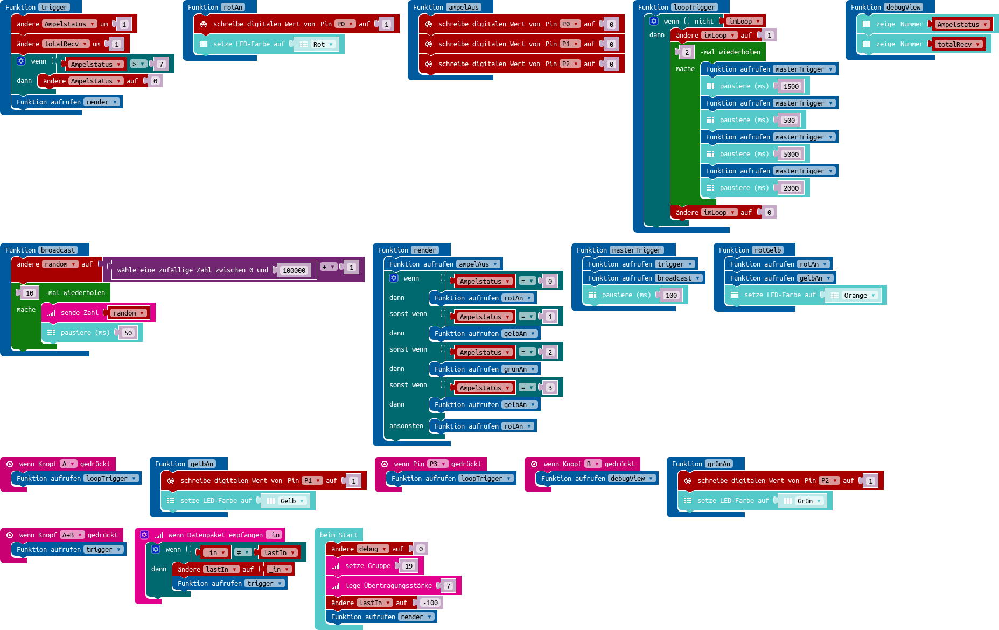

# Vernetzte Ampel

Ein relativ umfangreiches Script bei welchem die Ampeln miteinander Sprechen können.

Um dem Empfang sicherzustellen wird das Signal mehrfach gesendet, eien Zufallszahl wird mitgesendet um sicherzustellen dass ein Signal nicht doppelt verarbeitet wird.

## Setup

Auf alle Ampeln wird der gleiche Code gespielt. Ampeln welche eine andere Farbe als die anderen haben sollen, müssen über Drücken von A+B (Siehe Buton Layout) vorgeschalten werden.

## Button Layout

| Button |                                        Funktion                                        |
|--------|----------------------------------------------------------------------------------------|
| A      | Durchlaufe alle Ampelphasen                                                            |
| B      | Zeige Debug Informationen an (aktueller Status dann wie viele Pakete eingegangen sind) |
| A+B    | Schaltet den Ampel Status (angezeigte Farbe) Manuell vor -> stellt Offset ein          |
| P3     | Siehe A                                                                                |
## Pin Layout

| Pin | Funktion  |
|-----|-----------|
| P0  | Rote LED  |
| P1  | Gelbe LED |
| P2  | Grüne LED |
